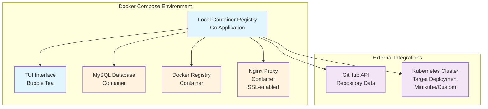

# Local Container Registry

A powerful Go application that provides a complete container development workflow with a beautiful terminal user interface (TUI). This application integrates GitHub repositories, local Docker registry, and Kubernetes deployments into a seamless development experience.


## 🏗️ Architecture

The application runs entirely within Docker Compose, providing a self-contained development environment that manages container images and deployments to external Kubernetes clusters.



## 🚀 Features

### Multi-Tab TUI Interface
- **Git Tab**: View recent commits, PR descriptions, and repository activity
- **Docker Tab**: Browse and manage Docker images in your local registry  
- **Kubernetes Tab**: Monitor pods, deployments, and cluster status

### Container Management
- **Local Docker Registry**: Push and pull images from localhost:5000
- **Image Discovery**: Automatically detects images in your local registry
- **Timestamp Tracking**: Shows when Docker images were created
- **Image Operations**: Delete images, pull from registry

### Kubernetes Integration  
- **Deploy to Kubernetes**: Deploy images directly from the TUI
- **Minikube Support**: Automatic image loading for Minikube environments
- **Pod Management**: View pod status, restarts, and details
- **Deployment Creation**: Create new deployments or update existing ones

### GitHub Integration
- **Commit Tracking**: Fetches recent commits from configured repository
- **Database Storage**: Stores commit data in MySQL database
- **PR Information**: Displays commit messages and metadata

## 📋 Prerequisites

- **Go**: Version 1.23.2 or higher
- **Docker & Docker Compose**: For running local registry
- **MySQL**: Database for storing commit data  
- **Kubernetes/Minikube**: For container deployments
- **GitHub API Token**: For repository integration
- **curl & jq**: For API interactions (optional but recommended)

## 🛠️ Installation & Setup

### 1. Clone the Repository

```bash
git clone https://github.com/anthony-gilbert/local-container-registry.git
cd local-container-registry
```

### 2. Install Dependencies

```bash
go mod download
```

### 3. Setup Environment Variables

Create a `.env` file in the project root:

```bash
cp .env.example .env
```

Then edit `.env` with your values. Required environment variables:
- `MYSQL_ROOT_PASSWORD` - Secure password for MySQL database

Optional environment variables:
- `GITHUB_OWNER`, `GITHUB_REPO`, `GITHUB_AUTH_TOKEN` - For GitHub integration
- `KUBERNETES_CONTROL_PLANE`, etc. - For custom Kubernetes clusters

### 4. Start the Complete Environment

The application runs entirely within Docker Compose. Start all services:

```bash
# Start all services (app, database, registry, nginx)
docker compose up -d

# Check that all containers are running
docker compose ps
```

This will start:
- **App**: The Go TUI application
- **Database**: MySQL database for storing commit data
- **Registry**: Docker registry at `localhost:5000`
- **Nginx**: SSL proxy at `https://localhost:443`

This starts:
- **Registry API**: `http://localhost:5000` (for pushing/pulling images)
- **Nginx Proxy**: `https://localhost:8443` (SSL-enabled access)

### 6. Setup Kubernetes (Minikube)

```bash
# Start Minikube
minikube start

# Enable registry addon
minikube addons enable registry

# Verify cluster is running
minikube status
```

## 🚀 Usage

### Starting the Application

The application runs automatically when you start Docker Compose. To interact with it:

```bash
# The TUI will be running in the background
# Attach to the running container to see the interface
docker compose logs -f app

# Or execute commands in the running container
docker compose exec app ./local-container-registry
```

For local development outside of Docker Compose:

```bash
# Run locally (requires external MySQL and registry)
go run .

# Or build and run
make build
./local-container-registry
```

### TUI Navigation

- **Tab/1-3**: Switch between Git, Docker, and Kubernetes tabs
- **↑/↓ or j/k**: Navigate through lists
- **Enter**: Deploy image (Docker tab) or view details (Kubernetes tab)
- **Ctrl+D**: Delete Docker image
- **Ctrl+P**: Pull image from registry
- **ESC**: Close modals or return to main view
- **q**: Quit application

## 🐳 Working with Docker Images

### Pushing Images to Local Registry

```bash
# Tag your image for the local registry
docker tag my-app:latest localhost:5000/my-app:latest

# Push to local registry
docker push localhost:5000/my-app:latest

# Verify image is in registry
curl -s http://localhost:5000/v2/_catalog
```

### Viewing Images in TUI

1. Run the application: `go run .`
2. Navigate to the **Docker** tab
3. Your images will appear with:
   - Image ID (shortened)
   - Repository name
   - Tag
   - Size
   - Creation timestamp

### Example Workflow: Building and Pushing

```bash
# Build your application
docker build -t localhost:5000/my-web-app:v1.0 .

# Push to local registry
docker push localhost:5000/my-web-app:v1.0

# Start the TUI to deploy
go run .
# Navigate to Docker tab → Select image → Press Enter → Deploy to Kubernetes
```

## ☸️ Kubernetes Deployments

### Deploying Through TUI

1. **Push image** to local registry (see above)
2. **Start TUI**: `go run .`
3. **Navigate to Docker tab**
4. **Select your image** and press **Enter**
5. **Choose deployment option**:
   - Create new deployment
   - Update existing deployment
6. **Confirm deployment**

The application automatically:
- ✅ Loads images into Minikube (if using Minikube)
- ✅ Sets `ImagePullPolicy: Never` for local images
- ✅ Creates proper Kubernetes manifests
- ✅ Handles registry hostname resolution
- ✅ : [Tabs] - [Docker] List The Docker Image IDs
- ✅ : [Tabs] - [Docker] List The Docker Image Size
- ✅ : [Tabs] - [Docker] List The Docker Image Tags(If available)
- [  &nbsp;&nbsp;&nbsp;]: [Tabs] - [Docker] Delete The Docker Image
- [  &nbsp;&nbsp;&nbsp;]: [Tabs] - [Docker] Delete The Docker Container
- [  &nbsp;&nbsp;&nbsp;]: [Tabs] - [Deployment] - Pull
- [  &nbsp;&nbsp;&nbsp;]: [Tabs] - [Deployment] - List
- [  &nbsp;&nbsp;&nbsp;]: [Tabs] - [Deployment] - Push
- [  &nbsp;&nbsp;&nbsp;]: [Tabs] - [Deployment] - Delete

### Manual Kubernetes Deployment

```yaml
apiVersion: apps/v1
kind: Deployment
metadata:
  name: my-app
spec:
  replicas: 1
  selector:
    matchLabels:
      app: my-app
  template:
    metadata:
      labels:
        app: my-app
    spec:
      containers:
      - name: app
        image: localhost:5000/my-app:latest
        imagePullPolicy: Never  # Important for local registry
        ports:
        - containerPort: 80
```

### Minikube Considerations

For Minikube environments, images are automatically loaded:

```bash
# This happens automatically in the TUI, but you can do it manually:
docker pull localhost:5000/my-app:latest
minikube image load localhost:5000/my-app:latest
```

## 🛠️ Available Commands

```bash
# Start complete environment
docker compose up -d

# Stop all services
docker compose down

# View logs
docker compose logs -f

# Restart services
docker compose restart

# Local development commands
make build
go build -o local-container-registry .
make run-local
go run .

# Build Docker image of the application
make docker-build
docker build -t local-container-registry .

# Run application in Docker (standalone)
make docker-run

# Clean up Docker images
make clean
```

## 📁 Project Structure

```
local-container-registry/
├── main.go              # Core application logic & GitHub/K8s integration
├── tui.go               # Terminal UI implementation (Bubble Tea)
├── compose.yaml         # Complete Docker Compose environment
├── init-db.sql          # MySQL database initialization
├── Dockerfile           # Application container build
├── Makefile            # Build and run commands
├── go.mod              # Go module dependencies
├── .env                # Environment variables (create this)
├── data/               # Registry storage directory
├── ssl-certs/          # SSL certificates for nginx
├── auth/               # Registry authentication (if enabled)
├── AGENT.md            # Agent configuration guide
├── README.md           # This documentation
└── REGISTRY_USAGE.md   # Detailed registry usage guide
```

## 🔧 Configuration

### Registry Configuration

The registry runs without authentication by default for development. Located at:
- **API**: `http://localhost:5000`
- **Storage**: `./data` directory
- **Nginx**: `https://localhost:8443` (with SSL)

### GitHub Integration

Configure your GitHub repository in `.env`:
- Get a personal access token from GitHub
- Set repository owner and name
- Application fetches last 10 commits on startup

### Kubernetes Configuration

Works with:
- **Minikube** (automatic detection)
- **Standard Kubernetes** clusters
- **Custom clusters** via environment variables

## 🐛 Troubleshooting

### Registry Issues

```bash
# Check if registry is accessible
curl -s http://localhost:5000/v2/_catalog

# Restart registry services
docker compose down && docker compose up -d

# Check registry logs
docker compose logs registry
```

### Kubernetes Issues

```bash
# Verify Minikube is running
minikube status

# Check if image is loaded in Minikube
minikube ssh docker images | grep my-app

# Load image manually if needed
minikube image load localhost:5000/my-app:latest
```

### Application Issues

```bash
# Check container status
docker compose ps

# View application logs
docker compose logs app

# Check MySQL connection (from host)
mysql -h 127.0.0.1 -P 3307 -u mysql -p$MYSQL_ROOT_PASSWORD images

# Or connect to MySQL container directly
docker compose exec db mysql -u mysql -p$MYSQL_ROOT_PASSWORD images

# Verify environment variables
cat .env

# Restart all services
docker compose restart
```

## 🔄 Development Workflow

### Typical Development Cycle

1. **Develop** your application
2. **Build** Docker image:
   ```bash
   docker build -t localhost:5000/my-app:$(git rev-parse --short HEAD) .
   ```
3. **Push** to local registry:
   ```bash
   docker push localhost:5000/my-app:$(git rev-parse --short HEAD)
   ```
4. **Deploy** via TUI:
   ```bash
   go run .
   # Navigate to Docker tab → Select image → Deploy
   ```
5. **Monitor** in Kubernetes tab
6. **Iterate** and repeat

### Best Practices

- **Use semantic versioning** for image tags
- **Clean up old images** regularly with `docker system prune`
- **Test locally** before deploying to production clusters
- **Use consistent naming** for repositories and tags
- **Monitor resource usage** in Kubernetes tab

## 📚 Additional Documentation

- **[Registry Usage Guide](REGISTRY_USAGE.md)**: Detailed guide for working with the local registry
- **[Agent Configuration](AGENT.md)**: Development setup and build commands
- **[Kubernetes Deployment Guide](KUBERNETES_DEPLOYMENT.md)**: Advanced Kubernetes deployment options

## 🤝 Contributing

1. Fork the repository
2. Create your feature branch: `git checkout -b feature/amazing-feature`
3. Commit your changes: `git commit -m 'Add amazing feature'`
4. Push to the branch: `git push origin feature/amazing-feature`
5. Open a Pull Request

## 📄 License

This project is licensed under the MIT License - see the LICENSE file for details.

## 🙏 Acknowledgments

- Built with [Bubble Tea](https://github.com/charmbracelet/bubbletea) for the TUI
- Uses [Docker Registry v2](https://docs.docker.com/registry/) for image storage
- GitHub API integration for repository data
- Kubernetes Go client for cluster operations
